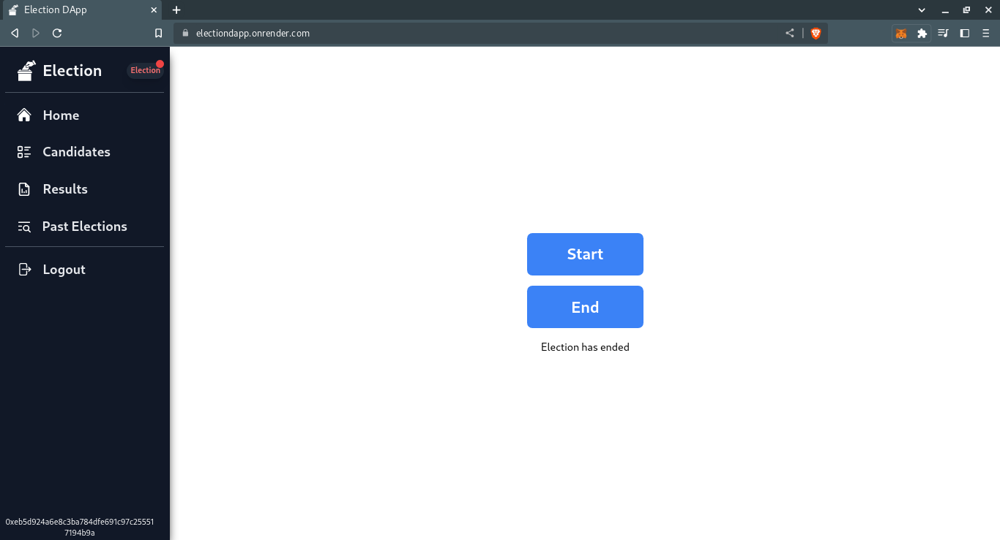
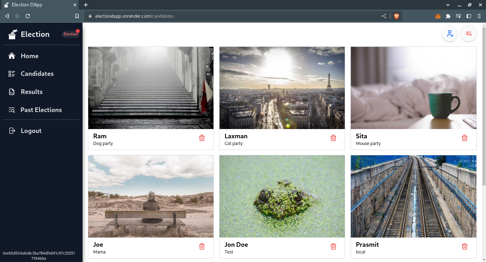
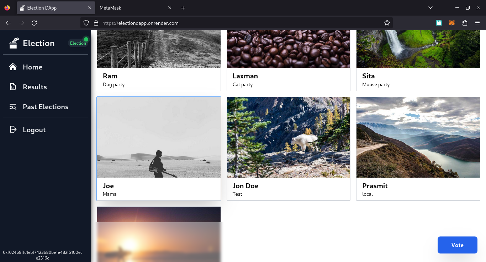
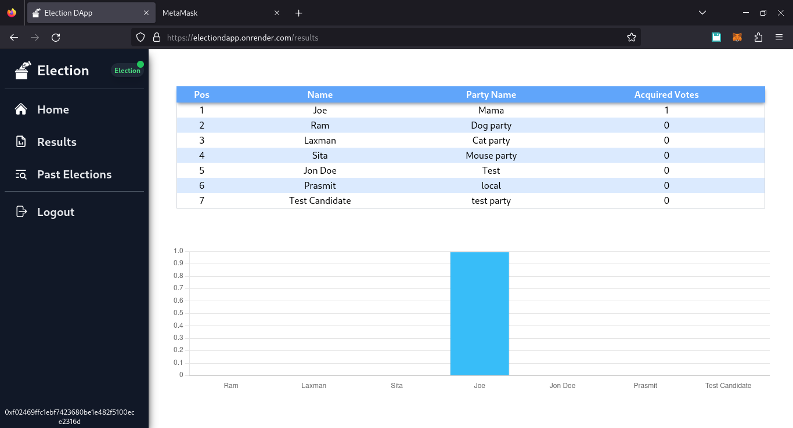

# Election Dapp

The UI of the election dapp that uses blockchain technology, allows users to vote for candidates and track the results of the election, built with React and Tailwind CSS.

## Other repos

- [API](https://github.com/rabin245/election_app_api)
- [Contract](https://github.com/rabin245/election_hardhat)

> Checkout to the `sepolia-testnet` branch to browse the deployed app code which uses the contract deployed in the sepolia testnet.

## Demo

Access the site [here](https://electiondapp.onrender.com)

## Project Screenshots






## Installation and Setup

- Clone the repository:
  ```shell
  git clone https://github.com/rabin245/election_ui.git
  cd election_ui
  ```
- Installation:

  `npm install`

- Start server:

  `npm run dev`

## Credits

List of contributors:

- [Aayush Raut](https://github.com/aayussraut)
- [Prasmit Neupane](https://github.com/pras557)
- [Amrit Khatiwada](https://github.com/amritkh078)
